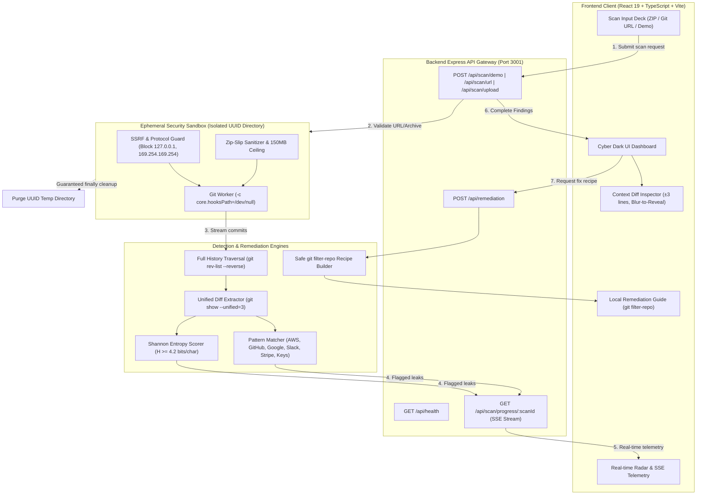

# System Architecture

## Overview
**SentraScan** (`DIV-Git-History-Secret-Scanner`) is architected as a high-performance, decoupled client-server web application engineered for deep Git commit history inspection, cryptographic entropy analysis, and ephemeral process isolation.

---

## Technology Stack

### Frontend Presentation Layer (`client/`)
- **Framework**: React 19 + TypeScript (Strict Mode)
- **Bundling & Tooling**: Vite 6
- **Styling**: Cyber Dark Aesthetic (Obsidian `#070a13`, Space Indigo `#0f172a`, Emerald `#10b981`, Rose `#f43f5e`, Amber `#f59e0b`, Cyan `#06b6d4`)
- **Icons & Visuals**: Lucide React + Tailwind-compatible CSS variables
- **State Management**: Reactive React state hooks with SSE streaming telemetry listeners

### Backend Service Layer (`server/`)
- **Runtime**: Node.js 24 (ES Modules / TypeScript NodeNext)
- **API Framework**: Express 4 with typed controllers and middleware
- **Execution & Sandboxing**: Native Node `child_process.execFile` with argument vectors (no shell interpolation) and strict execution timeouts (90s)
- **Archive Ingestion**: Multer + `adm-zip` with Zip-Slip path sanitization
- **Real-Time Telemetry**: Server-Sent Events (`text/event-stream`) streaming commit-by-commit progress

### Secret Scanner & Entropy Engine (`server/src/scanner/`)
- **Git History Walker**: `git rev-list --reverse HEAD` and `git show --unified=3`
- **Pattern Matching**: Pre-compiled regex catalog across 10+ provider credential families
- **Shannon Entropy**: Pure TypeScript Shannon entropy computation ($H(X) = -\sum P(x) \log_2 P(x)$) with character frequency histograms

### Ephemeral Sandbox & Hardening (`server/src/sandbox/`)
- **Process Isolation**: Unique OS temp directories (`/tmp/sentrascan_<uuid>`)
- **Anti-RCE Safeguard**: `-c core.hooksPath=/dev/null` on all Git subprocesses
- **SSRF Barrier**: Hostname and IP parser rejecting private subnets, loopbacks, and cloud metadata
- **Automatic Lifecycle Hook**: Guaranteed directory deletion in `finally` blocks

---

## Architectural Data Flow



---

## Repository Structure

```
DIV-Git-History-Secret-Scanner/
├── .env.example              # Environment variable definitions template
├── .gitignore                # Root gitignore (build outputs, node_modules, logs)
├── ARCHITECTURE.md           # System architecture, data flow, & directory layout
├── DECISIONS.md              # Architecture Decision Records (ADR-001 to ADR-008)
├── DESIGN.md                 # Design system, UI aesthetic, color palette, & typography
├── docker-compose.yml        # Ephemeral container orchestration config
├── Dockerfile                # Production multi-stage hardened container build
├── MEMORY.md                 # Project operational memory, active state, & roadmap
├── package.json              # Root workspace management script config
├── PRD.md                    # Product Requirements Document
├── README.md                 # Comprehensive project showcase & quickstart
├── RULES.md                  # Development guidelines, type safety, & security invariants
├── SECURITY.md               # Security policy, threat model, & vulnerability mitigations
├── TASKS.md                  # Phased engineering task checklist & tracker
├── TEST_PLAN.md              # Automated & manual test verification matrix
├── client/                   # React 19 Frontend Web Application
│   ├── index.html            # Vite HTML5 entrypoint
│   ├── package.json          # Client dependencies & scripts
│   ├── tsconfig.json         # Client TypeScript configuration
│   ├── vite.config.ts        # Vite configuration & proxy settings
│   └── src/
│       ├── App.css           # Cyber Dark UI design system & CSS variables
│       ├── App.tsx           # Primary application container & scan workflows
│       ├── main.tsx          # React DOM root mounting
│       ├── types.ts          # Frontend TypeScript interface models
│       └── components/       # Reusable UI component modules
│           ├── FindingCard.tsx      # Finding card with blur toggle & context diff
│           ├── Header.tsx           # Top navigation & system status indicators
│           ├── RemediationModal.tsx # Safe git filter-repo guide modal
│           ├── ScanForm.tsx         # Scan input deck (ZIP, URL, Demo) & entropy tuning
│           └── ScanProgress.tsx     # Real-time animated radar & commit progress
└── server/                   # Express + TypeScript Scanner Backend
    ├── package.json          # Server dependencies & scripts
    ├── tsconfig.json         # NodeNext TypeScript configuration
    ├── src/
    │   ├── index.ts          # Express server entrypoint & API endpoints
    │   ├── types.ts          # Core domain models (CommitInfo, Finding, ScanOptions)
    │   ├── remediation/
    │   │   └── remediationGenerator.ts # Safe git filter-repo recipe builder
    │   ├── sandbox/
    │   │   ├── demoRepo.ts    # In-memory 5-commit test repository generator
    │   │   └── repoManager.ts # SSRF validation, cloning, unzipping, & cleanup
    │   └── scanner/
    │       ├── entropy.ts     # Shannon entropy computation engine
    │       ├── gitScanner.ts  # Git commit DAG traversal & context diff extractor
    │       └── patterns.ts    # Curated regex signatures for secret families
    └── test/
        └── scanner.test.ts   # Automated unit & integration test suite
```

---

## Architectural Invariants & Rules

1. **Zero Server Rewrite Invariant**: Under no circumstances may the server invoke `git filter-repo`, `git filter-branch`, `git reset --hard`, or any command that mutates or rewrites Git history. All history-scrubbing recipes must only be generated as text instructions for developer local execution.
2. **Anti-RCE Invariant**: Every invocation of `git` against untrusted repositories must include `-c core.hooksPath=/dev/null` or `-c core.hooksPath=""` to prevent malicious hook scripts (`post-checkout`, `pre-push`) from executing.
3. **Ephemeral Lifecycle Invariant**: Every cloned or extracted repository exists strictly inside a UUID-keyed directory and must be deleted inside a `finally` block before the API response finishes.
4. **Offline Scanner Invariant**: Once a repository is cloned or unzipped, the scanner execution operates completely detached from the network.
