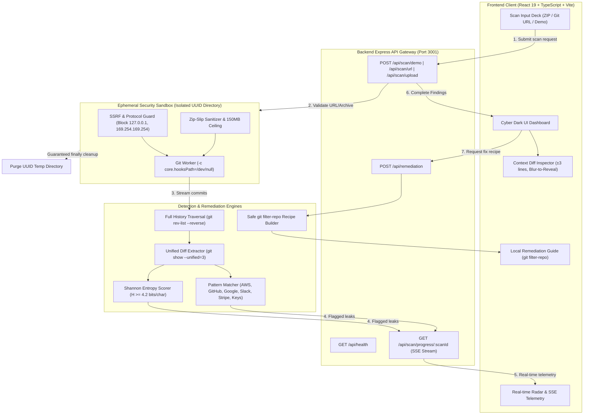

# SentraScan — Git History Secret Scanner 🛡️

[](file:///test/scanner.test.ts)
[](file:///server/tsconfig.json)
[](file:///client/package.json)
[](file:///Dockerfile)
[](file:///LICENSE)

> *Ever pushed an API key by accident, then deleted it in the next commit and figured you were fine? You weren't — Git remembers everything, forever. That deleted secret is still sitting in your project's history, and anyone who clones the repo can dig it up. I built SentraScan to fix that. It goes through every single commit in a repo's history.*

---

## 📑 Engineering Specifications & Governance Suite

| Specification Document | Focus & Key Contents |
|---|---|
| [`PRD.md`](./PRD.md) | **Product Requirements Document**: Problem statement, target users, core features, MVP boundaries, and success criteria. |
| [`ARCHITECTURE.md`](./ARCHITECTURE.md) | **System Architecture**: Complete decoupled stack, Mermaid end-to-end data flow, folder layout, and architectural invariants. |
| [`DESIGN.md`](./DESIGN.md) | **Design System & UI/UX**: Cyber Dark aesthetic, color palette tokens, JetBrains Mono typography, finding cards, radar sweeps, and responsive breakpoints. |
| [`RULES.md`](./RULES.md) | **AI & Engineering Rulebook**: Strict coding guidelines, TypeScript standards, anti-RCE hook disablement, and zero-server-rewrite invariant. |
| [`TASKS.md`](./TASKS.md) | **Phased Task Tracker**: 35 completed engineering milestones across 7 development phases. |
| [`DECISIONS.md`](./DECISIONS.md) | **Architecture Decision Records (ADRs)**: Technical decisions ADR-001 through ADR-008 (full history DAG traversal, dual-layer entropy scoring, ephemeral sandboxing). |
| [`MEMORY.md`](./MEMORY.md) | **Project Memory**: Active operational state, completed milestones, key patterns, and future roadmap. |
| [`TEST_PLAN.md`](./TEST_PLAN.md) | **Test Plan & QA Matrix**: Automated test specifications for entropy, pattern signatures, SSRF barriers, Zip-Slip, and responsive screen viewports. |
| [`SECURITY.md`](./SECURITY.md) | **Security Policy & Threat Model**: Anti-RCE execution guarantees, SSRF IP blocking, ephemeral cleanup lifecycle, and vulnerability disclosure SLA. |
| [`.env.example`](./.env.example) | **Environment Configuration Template**: Port, timeout ceilings, upload limits, and Shannon entropy tuning thresholds. |

---

## 🌟 Key Capabilities

1. **Complete Commit History Traversal**: Reconstructs unified diffs across every historical commit using sanitized `git rev-list --reverse HEAD`. Computes the exact relative depth (**`X commits ago`**), author name, author email, commit timestamp, commit message, and full 40-character SHA.
2. **Dual-Layer Detection Engine**:
   - **Curated Pattern Signatures**: Regular expressions covering AWS IAM access keys (`AKIA...`, `ASIA...`), GitHub PATs (Classic, Fine-Grained, OAuth), GitLab PATs, Google Cloud API keys, Slack tokens & webhooks, Stripe live keys, OpenAI tokens, Private Key headers, JWTs, and Database URIs with credentials.
   - **Shannon Information Entropy**: Computes $H(X) = -\sum P(x_i) \log_2 P(x_i)$ in bits per character with tunable sensitivity thresholds (default `4.2` bits/char) and minimum token length filters to catch custom tokens while suppressing false alarms.
3. **Contextual Diff Inspector with Blur-to-Reveal**:
   - Displays exact line numbers with **±3 lines of surrounding code context** before and after the leak.
   - Built-in **blur-to-reveal secret masking** (`filter: blur(5px)`) to shield credentials from shoulder surfing during live presentations or screen shares.
4. **Guaranteed Ephemeral Sandboxing**:
   - **Anti-RCE Guarantee**: Disables Git hook triggers across all clone and diff operations using `-c core.hooksPath=/dev/null`.
   - **SSRF Defense**: Validates public HTTP/HTTPS protocols, strictly blocking private IP ranges (`10.0.0.0/8`, `192.168.0.0/16`), loopbacks (`127.0.0.1`), and cloud metadata (`169.254.169.254`).
   - **Zip-Slip & Bomb Protection**: Validates extraction paths preventing `../` traversal, enforcing a 150MB uncompressed ceiling.
   - **Guaranteed Ephemeral Purging**: UUID-keyed workspace directories systematically destroyed inside `finally` blocks.
5. **Safe Local Remediation Mode**:
   - Generates exact, copy-pasteable `git filter-repo` and `git filter-branch` command recipes.
   - **Strict Invariant**: SentraScan **never** runs destructive rewrite commands on the server; all scrubbing happens locally on the developer's workstation.
   - Provider-specific key revocation checklists for AWS, GitHub, Google Cloud, Slack, and Stripe.
6. **Instant 1-Click Demo Repository**: Built-in test repository with 5 historical commits demonstrating realistic credentials and historical deletions across multiple commits.

---

## 🏗️ System Architecture



---

## 🚀 Quick Start

### 1. Prerequisites
- **Node.js**: v20 or higher (v24 recommended)
- **Git**: Installed and available in your system `PATH`
- **npm**: v10 or higher

### 2. Running Locally (Development Mode)
```bash
# Clone the repository
git clone https://github.com/Divyansh-co/DIV-Git-History-Secret-Scanner.git
cd DIV-Git-History-Secret-Scanner

# Install dependencies for both client and server
npm --prefix server install
npm --prefix client install

# Start backend server on port 3001
npm --prefix server run dev

# In a separate terminal, start frontend dev server on port 5173
npm --prefix client run dev
```
Open [http://localhost:5173](http://localhost:5173) in your browser.

### 3. Running in Production Mode (Unified Single Port)
```bash
# Build both client and server bundles
npm run build

# Start production server on port 3001
npm start
```
Open [http://localhost:3001](http://localhost:3001) in your browser.

### 4. Running with Docker Sandbox
```bash
# Build and run the hardened ephemeral container
docker compose up --build
```
Open [http://localhost:3001](http://localhost:3001). The container runs as an unprivileged user (`UID 10001 sentrascan`) with strict CPU (`--cpus=1.0`) and memory (`--memory=512m`) limits.

---

## 🧪 Automated Testing
SentraScan includes a comprehensive automated test suite verifying Shannon entropy calculations, regex signatures, SSRF sanitization, multi-commit history scanning, and ephemeral cleanup:
```bash
npm --prefix server test
```
All unit and integration tests execute in < 2 seconds.

---

## 🔒 Security Architecture Highlights
- **Zero-Hook Anti-RCE**: Clones executed strictly with `-c core.hooksPath=/dev/null`.
- **SSRF Barrier**: Rejecting all loopbacks (`127.0.0.1`), RFC 1918 subnets, and cloud metadata (`169.254.169.254`).
- **Zip-Slip Mitigation**: Validates target canonical paths before extraction.
- **Zero-Persistence Guarantee**: All repos extracted into UUID temp dirs wiped in `finally` blocks.
- **Non-Destructive Server**: Never executes git rewrite commands on user code.

---

## 👤 Author
**Divyansh Mishra**  
- GitHub: [@Divyansh-co](https://github.com/Divyansh-co)  
- Email: `divyanshmishra.python@gmail.com`
